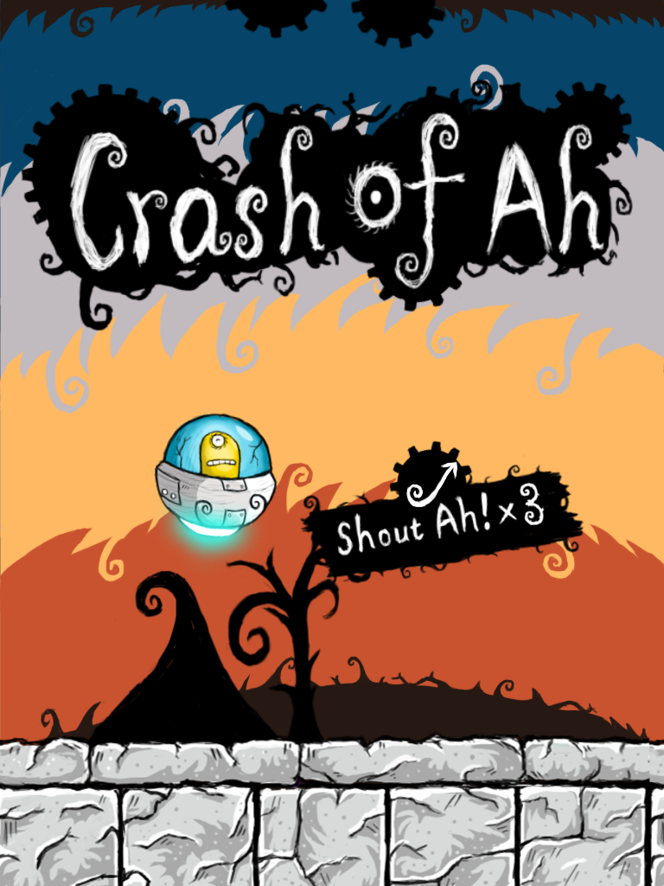
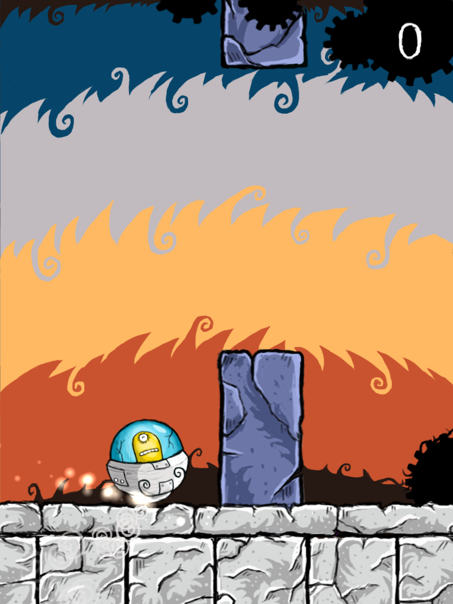

{
    "title": "Crash of Ah Is Launched",
    "author": "Chengzhi Yang",
    "createDate": "2014-04-18",
    "modifyDate": "2014-04-18",
    "permanent":"crash-of-ah-is-launched"
}

# Crash of Ah Is Launched

After fixed a critical Bug on iOS 6. My iOS hilarious voice control game Crash of Ah was launched. It has a very simple mechanical to play. You shout “Ah” to control the Ah’s spaceship and dodge the stone pillars like Flappy Bird. It’s full of fun especially play with friends.

This game made by my own. In the first I decided to finished the game in 2 weeks, but I finished the game over 2 months. In the develop time I found I could improve every part of my game, like program functional, graphics and sound effects, and I enjoy it. So I decided to make the game as better as possible. It’s the main cause of the delay.

### Main features:

* Background music(or noise…).
* Encryption mechanical to protect graphic resources. It’s order to prevent the copycat from copy the game into another platform.
* Encryption Game Center score saving mechanical to protect the offline score. It’s prevent the score cheater from replacing the offline score file.
* I drawn all graphics on a Wacom tablet.
* Game promote web pages.
* Game promote video.
* If you haven’t try this little game, you must check it out on App store.

[Download on App Store](https://itunes.apple.com/en/app/crash-of-ah/id848386594?ls=1&mt=8)

[Promote Page](http://codingmelody.com/crash-of-ah.html)

