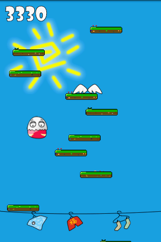

{
    "title": "蛋人跳吧",
    "author": "Chengzhi Yang",
    "createDate": "2011-03-25",
    "modifyDate": "2011-03-25",
    "permanent":"eggman-jump-android-cn"
}

# 蛋人跳吧

## 游戏介绍：
蛋人跳吧是一个有趣又极富挑战性的跳跃类游戏！
蛋人们原本幸福快乐的生活在蛋村中，有一天一群水里面来的动物袭击了蛋村！蛋人们只好逃跑了，他们通过神秘古老的台阶跳向迷一样的天空去发现属于他们的新的世界！

游戏完全免费!内置完全免费的国际化的游戏积分平台(openfeint)，你可以通过全球排行榜挑战全世界的玩家。还有成就系统等你来挑战。

### 版本信息:
目前版本v1.2 （2011.4.3 更新）
* 最高分数和成就能够记录在本地，有网络连接后会自动同步。
* 摄像机的速度修正。
* 难度降低
* 有图片增加。
* “分享”按钮，你可以方便的把蛋人分享给你的朋友们

## 游戏截图：

