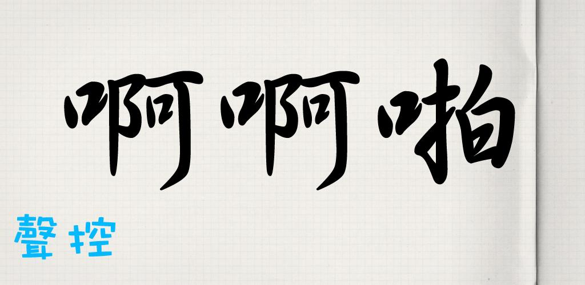

{
    "title": "啊啊啪",
    "author": "Chengzhi Yang",
    "createDate": "2011-04-17",
    "modifyDate": "2011-04-17",
    "permanent":"voice-fighter-for-android-cn"
}

# 啊啊啪

从谷歌电子市场下载：[下载](market://details?id=me.codeand.ahahpah)

从网页版的谷歌电子市场下载：[下载](https://market.android.com/details?id=me.codeand.ahahpah)

## 游戏介绍：
啊啊啪是一个涂鸦风格的#声控#游戏！
在游戏里面你用声音来控制战机，轻声“啊”可以控制飞机的飞行高度，大声的“啪”（pa）可以让飞机发射子弹！ 非常欢乐的声控游戏！

## 游戏截图：

