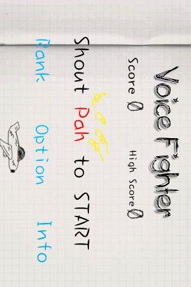

{
    "title": "Voice Fighter for Android",
    "author": "Chengzhi Yang",
    "createDate": "2011-04-17",
    "modifyDate": "2011-04-17",
    "permanent":"voice-fighter-for-android"
}

# Voice Fighter

AhahPah in Android Market: [DownLoad!](market://details?id=me.codeand.ahahpah_en)

AhahPah in Web Android Market : [DownLoad!](https://market.android.com/details?id=me.codeand.ahahpah_en)

The game you play with your mouth!
Voice Fighter is a doodle style Voice control shooting game！
The game you play with your mouth!
**Use only your VOICE.**

Say Ahhh to control the ship.

shout Pah to shoot.

**Please note**:So far, These following phone can’t running “Voice Fighter” normally. Sony Ericsson X10, Acer A1, MEIZU M9.

## Screenshot:

