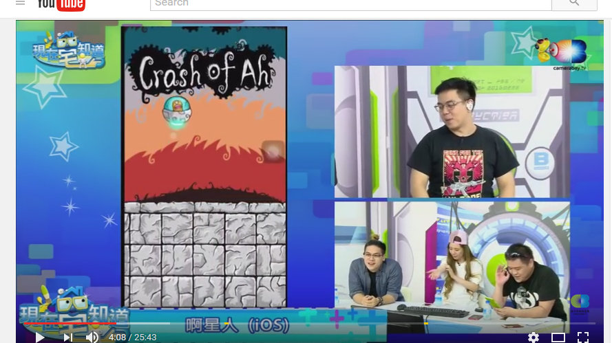
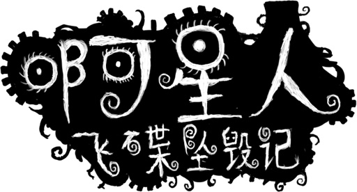
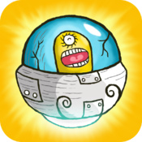

{
    "title": "被钱砸醒",
    "author": "Chengzhi Yang",
    "createDate": "2016-09-30",
    "modifyDate": "2016-09-30",
    "permanent":"woke-by-money"
}

# 被钱砸醒

今早我是被钱砸醒，还是美刀[钱]。事情是这样的，半醒状态收到条短信：190多美刀汇入帐号。我还以为不小心错买了什么，或者难道人命币活期会自动像余额宝一样自动转入外汇帐号？查一下发现是APPLE汇入的，跳起来查APPLE帐号，发现是我一个两年前做的小游戏卖了200刀的样子，然后再查，发现是一个台湾的有19W订阅量的youtube频道做了一期我的游戏的视频：https://www.youtube.com/watch?v=KbkQ3mUKLNc  视频浏览量：37,507 views   

介绍下，这个游戏是我两年前做的小游戏，一个声控的flappy bird，嗯，还有个故事背景呢，如下：
《啊星人飛碟墜毀記​》 - 看起來啊星人飛碟的曲速引擎出現了故障，把啊星人傳送到了一個由古老能量籠罩的星球。啊星人的飛碟堅韌無比，不過碰到神秘的石柱還是會毀壞。啊星人飛碟的自動巡航系統也出現了故障，現在已經切換到“嘴動駕駛”，請大喊“啊”來控制啊星人的飛碟，避開石柱。 Live long and prosper!

游戏下载地址：
国服(可能已经因为无审查已经被和谐了吧，没试过)：https://itunes.apple.com/cn/app/a-xing-ren-fei-die-zhui-hui-ji/id848386594?l=zh&mt=8
台服： https://itunes.apple.com/tw/app/a-xing-ren-fei-die-zhui-hui-ji/id848386594?l=zh&mt=8
美服： https://itunes.apple.com/en/app/crash-of-ah/id848386594?ls=1&mt=8

啊星人飞碟坠毁记
